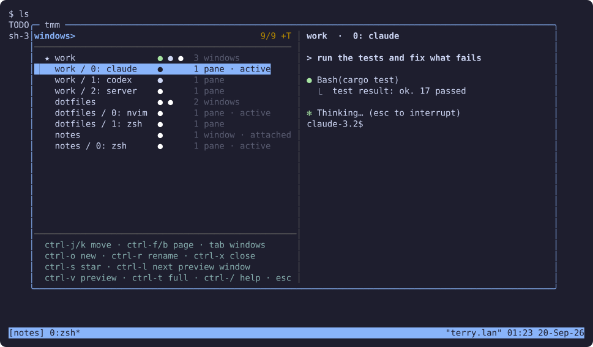

# tmm

[English](README.md)

个人用的 tmux 管理插件：一个 fzf 弹窗，用来在 session 和窗口之间切换、新建、
改名、关闭，并在有 Claude Code / Codex 的窗口上用绿点或黄点显示它是在工作还是在等你。
Rust 单二进制，每个按键只跑一次几毫秒的子命令。



## 安装

依赖 tmux 3.3+ 和 fzf 0.74.3+。

用 [TPM](https://github.com/tmux-plugins/tpm) 的话，加上插件后按 `prefix + I`：

```tmux
set -g @plugin 'zhu-jiyuan/tmm'
```

插件会把对应平台的 release 二进制下载到脚本旁边，用 GitHub 公布的 digest 校验；
没有对应平台的 release 时用 cargo 编译。`prefix + U` 更新插件时二进制一起更新。

手动安装：`cargo build --release`，或从 Releases 下载对应平台的 tarball 解压。
然后在 tmux 配置里加一行并重载：

```tmux
run-shell /path/to/tmm.tmux
```

想看 agent 的工作 / 等待状态，跑一次 `tmm install-hooks`，它会把 hook 合并进
`~/.claude/settings.json` 和 `~/.codex/hooks.json`（先备份）。

## 键位

`prefix + s` 打开 session 列表，`prefix + w` 打开窗口列表，`prefix + f` 打开项目
列表。打开后直接打字过滤。

| 键 | 动作 |
|---|---|
| `Ctrl-j` `Ctrl-k` | 移动，`Ctrl-f` `Ctrl-b` 翻页 |
| `Enter` | 切换过去；没有匹配时新建同名 session |
| `Tab` | 在 session / 窗口 / 项目列表之间轮换 |
| `Ctrl-o` `Ctrl-r` `Ctrl-x` | 新建 / 改名 / 关闭，都在输入行内完成 |
| `Ctrl-s` | 收藏，置顶 |
| `Ctrl-l` | 预览下一个窗口 |
| `Ctrl-v` `Ctrl-t` | 开关预览 / 全屏预览 |
| `Ctrl-/` | 键位提示 |
| `Esc` | 关闭 |

选项：`@tmm-session-key`、`@tmm-window-key`、`@tmm-project-key`、`@tmm-projects`、
`@tmm-switch-width`、`@tmm-switch-height`、`@tmm-bin`，写在 `run-shell` 之前。

## 项目

把 `@tmm-projects` 指向存放项目的目录，`prefix + f` 就会列出其中的项目，开着的和
没开的都有。`Enter` 切换到项目的 session，没有就以该目录为工作目录新建一个。

```tmux
set -g @tmm-projects "~/work ~/oss:2"
```

每个根目录默认扫一层，`:N` 指定层数，隐藏目录跳过。session 按启动目录归属项目，
用别的方式开的也能对上。没有匹配时输入一个路径按 `Enter` 直接打开它。没设这个
选项时 `prefix + f` 保持 tmux 原来的功能。
